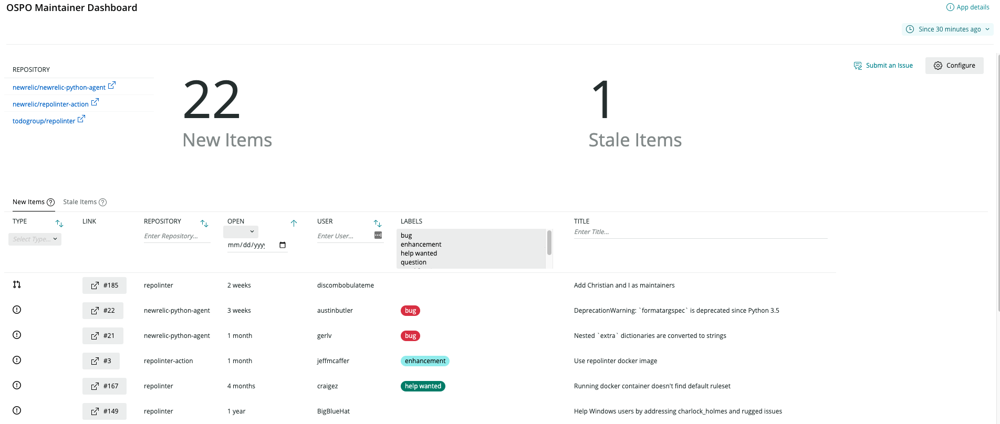

[](https://opensource.newrelic.com/oss-category/#new-relic-experimental)

# NR1 OSPO Maintainer Dashboard

 [](https://snyk.io/test/github/newrelic/nr1-ospo)

## About this Nerdpack

This application scans a set of GitHub repositories for new or stale Issues or PRs, and presents them in a easily digestible dashboard. We created this dashboard to help teams with large numbers of repositories keep up with community contributions.



## How it Works

This dashboard uses GitHub's [GraphQL API](https://docs.github.com/en/free-pro-team@latest/graphql) and powerful [search syntax](https://docs.github.com/en/free-pro-team@latest/github/searching-for-information-on-github/searching-on-github) to find a list of repositories for Issues or Pull Requests that fall into two categories:
* **New** - An Issue or PR opened by someone outside the company that has not yet received a response from inside the company.
* **Stale** - An Issue or PR opened by someone outside the company that has received a response from inside the company, but has not received a subsequent reply or follow-up after a certain period of time.

These categories were designed to encourage regular community interaction, and prevent Issues/PRs from "slipping through the cracks" in a team maintaining a large number of repositories. Each of these categories is implemented as a GraphQL query that is run when the dashboard is launched. For more technical details on how Issues/PRs are categorized you can check out the queries in [githubData.js](./nerdlets/maintainer-dashboard/graphql/githubData.js).

To access GitHub's GraphQL API, a [personal access token](https://docs.github.com/en/free-pro-team@latest/github/authenticating-to-github/creating-a-personal-access-token) is required. This dashboard asks the user to a token for their own account, and stores the provided token in [NerdstorageVault](https://developer.newrelic.com/explore-docs/nerdstoragevault).

A key part of the Issue/PR classification process is determining which GitHub users are contributing from "inside the company". GitHub (even enterprise) does not provide a readily available method for determining the employee status of a given login—as a result, it was determined that a separate database of company-associated GitHub logins must be provided to this dashboard in addition to the data provided by GitHub's APIs. At the moment this database is consumes as an Account-scoped [NerdStorage](https://developer.newrelic.com/explore-docs/nerdstorage) document containing a list of all company-associated GitHub handles (this is likely to change in the future). Since this document is account-scoped, it can be deployed once for the entire organization.

## Open source license

This project is distributed under the [Apache 2 license](LICENSE).

## What do you need to make this work?

 * You will need to generate a list of company-associated GitHub logins, and write them to an Account-scoped NerdStorage document. More information on this process can be found in [Setting up Employee Metadata](#setting-up-employee-metadata).
 * You will need to set up a [Personal Access Token](https://docs.github.com/en/free-pro-team@latest/github/authenticating-to-github/creating-a-personal-access-token) to allow this dashboard to communicate with GitHub's GraphQL API.

## Getting started

1. If this nerdpack has never been deployed in your organization, follow the [Setting up Employee Metadata](#setting-up-employee-metadata) instructions.
2. Ensure that you have [Git](https://git-scm.com/book/en/v2/Getting-Started-Installing-Git) and [NPM](https://www.npmjs.com/get-npm) installed. If you're unsure whether you have one or both of them installed, run the following commands. (If you have them installed, these commands return a version number; if not, the commands aren't recognized.)
  ```bash
  git --version
  npm -v
  ```
3. Install the [NR1 CLI](https://one.newrelic.com/launcher/developer-center.launcher) by going to [the developer center](https://one.newrelic.com/launcher/developer-center.launcher), and following the instructions to install and set up your New Relic development environment. This should take about 5 minutes.
4. Execute the following command to clone this repository locally:
  ```bash
  nr1 nerdpack:clone -r https://github.com/newrelic/nr1-ospo.git
  cd nr1-ospo
  nr1 nerdpack:serve
  ```
5. In the project directory, create a `deploy-settings.json` file with account ID used for the employee metadata, shown below:
  ```JSON
  { "accountId": "<account ID here>" }
  ```
6. Run `nr1 nerdpack:serve` and visit [https://one.newrelic.com/?nerdpacks=local](https://one.newrelic.com/?nerdpacks=local) to launch your app locally.

## Deploying this Nerdpack

If this nerdpack has never been deployed in your organization or the `uuid` of the nerdpack has changed, follow the [Setting up Employee Metadata](#setting-up-employee-metadata) instructions. Also ensure that the `deploy-settings.json` file has been setup according to [Getting Started](#getting-started). Open a command prompt in the app's directory and run the following commands.

```bash
# If you need to create a new uuid for the account to which you're deploying this app, use the following
# nr1 nerdpack:uuid -g [--profile=your_profile_name]
# to see a list of APIkeys / profiles available in your development environment, run nr1 credentials:list
nr1 nerdpack:publish [--profile=your_profile_name]
nr1 nerdpack:deploy [-c [DEV|BETA|STABLE]] [--profile=your_profile_name]
nr1 nerdpack:subscribe [-c [DEV|BETA|STABLE]] [--profile=your_profile_name]
```

Visit [https://one.newrelic.com](https://one.newrelic.com), and launch your app in New Relic.

## Setting Up Employee Metadata

As GitHub does not provide a built-in method for determining company association, a database of company-associated GitHub handles must be made available to the dashboard for the categorization process. This database currently takes the form of an Account-scoped [NerdStorage](https://developer.newrelic.com/explore-docs/nerdstorage) document. This document must be setup once before deploying the dashboard, and then updated as the list of GitHub handles at your company changes.

In order to create this document, you will first need to choose or create an account in your organization that any prospective user of the dashboard deployment can read--this ensures that the dashboard will have permissions to read the document when accessed by other users in the organization. Once you've chosen an account, you can install the employee metadata NerdStorage document to that account by following the instructions below:
1. Install [newrelic CLI](https://developer.newrelic.com/automate-workflows/get-started-new-relic-cli) and set it up with a Personal API key and the same region as your chosen account.
2. Retrieve a list of GitHub handles associated with your company, and format them into the following JSON structure, and save the result to a file. Ensure the comments are removed to prevent errors.
  ```JavaScript
  {
    "users": [
      // List company GitHub logins below.
      // Do not use emails here, as a GitHub login can be associated with more than one email.
      "github-handle1",
      "github-handle2",
      // ...
    ]
  }
  ```
3. Run the following newrelic cli command, replacing `{json file name}` with the name of the JSON file generated above, `{account id}` with the numerical ID of the chosen account, and `{nerdpack id}` with the nerdpack ID found in [nr1.json](./nr1.json):
  ```sh
  newrelic nerdstorage document write -a {account id} -d {nerdpack id}-employeeMetadata-v1 -c {nerdpack id}-employeeMetadata-v1 -s ACCOUNT -o "$(< {json file name})" -p {nerdpack id}
  ```

Finally, you will need to indicate to the dashboard which account to check for employee metadata--this can be done by creating a `deploy-settings.json` file at the root of the project with the following contents:
```JSON
{
  "accountId": "{account id}"
}
```

# Support

New Relic has open-sourced this project. This project is provided AS-IS WITHOUT WARRANTY OR DEDICATED SUPPORT. Issues and contributions should be reported to the project here on GitHub.

We encourage you to bring your experiences and questions to the [Explorers Hub](https://discuss.newrelic.com) where our community members collaborate on solutions and new ideas.

## Issues / enhancement requests

Issues and enhancement requests can be submitted in the [Issues tab of this repository](../../issues). Please search for and review the existing open issues before submitting a new issue.

## Security

As noted in our [security policy](../../security/policy), New Relic is committed to the privacy and security of our customers and their data. We believe that providing coordinated disclosure by security researchers and engaging with the security community are important means to achieve our security goals.

If you believe you have found a security vulnerability in this project or any of New Relic's products or websites, we welcome and greatly appreciate you reporting it to New Relic through [HackerOne](https://hackerone.com/newrelic).

# Contributing

Contributions are encouraged! If you submit an enhancement request, we'll invite you to contribute the change yourself. Please review our [Contributors Guide](CONTRIBUTING.md).

Keep in mind that when you submit your pull request, you'll need to sign the CLA via the click-through using CLA-Assistant. If you'd like to execute our corporate CLA, or if you have any questions, please drop us an email at opensource+nr1-ospo@newrelic.com.
